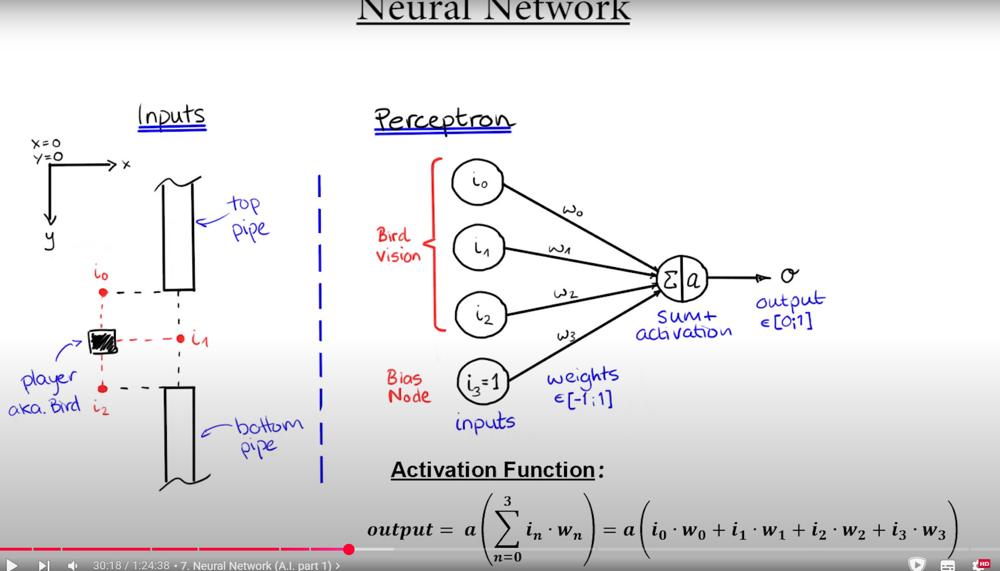
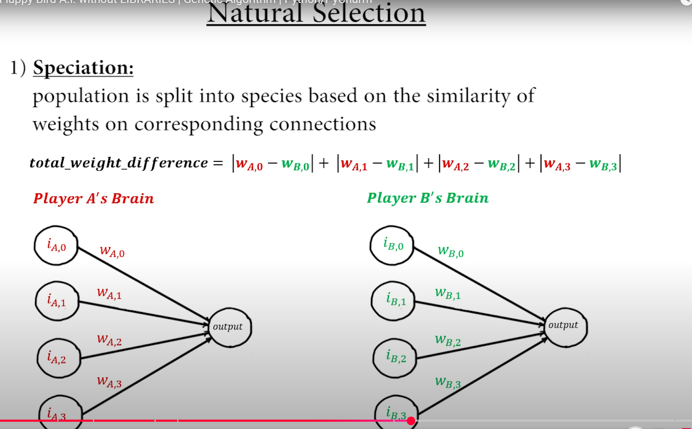

Following the tutorial https://www.youtube.com/watch?v=zsGvCwaaMOI

Goal of it is to learn about Genetic Algorithms.

Splitting the population into species based on the similarity of weights on corresponding connections.

Steps for Genetic Algorithms:

1. Speciation

i.e. Putting similar weights into the same species

2. Calculation of the Fitness:
- player: the longer a player survives, the higher his fitness
- species: average fitness across players within a species

3. Sort by Fitness:
- for each species, sort all players by fitness
- sort all species within the population by average fitness

4. Generate Children:
- children are geneated by mutating the weights of the connections in the neural net
- creating children of the very best species
